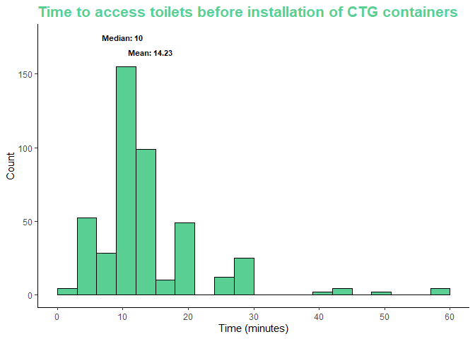

<!-- README.md is generated from README.Rmd. Please edit that file -->

# cleanteamghana

<!-- badges: start -->

[](https://zenodo.org/doi/10.5281/zenodo.10439886)
[](https://github.com/openwashdata/cleanteamghana/actions/workflows/R-CMD-check.yaml)
<!-- badges: end -->

This package contains compiled data utilized in a research paper
examining the user experience of the Clean Team Ghana’s container-based
sanitation service in Kumasi, Ghana.



## Installation

You can install the development version of cleanteamghana from
[GitHub](https://github.com/) with:

``` r
# install.packages("devtools")
devtools::install_github("openwashdata/cleanteamghana")
```

Alternatively, you can download the individual dataset as a CSV or XLSX
file from the table below.

| dataset        | CSV                                                                                                     | XLSX                                                                                                      |
|:---------------|:--------------------------------------------------------------------------------------------------------|:----------------------------------------------------------------------------------------------------------|
| cleanteamghana | [Download CSV](https://github.com/openwashdata/cleanteamghana/raw/main/inst/extdata/cleanteamghana.csv) | [Download XLSX](https://github.com/openwashdata/cleanteamghana/raw/main/inst/extdata/cleanteamghana.xlsx) |

# The research paper

The research paper associated with this data package is named
[“Evaluation of user experiences for the Clean Team Ghana
container-based sanitation service in Kumasi,
Ghana”](https://iwaponline.com/washdev/article/12/3/336/86884/Evaluation-of-user-experiences-for-the-Clean-Team)
(Tidwell et al., 2022).

*Tidwell, J. B., Nyarko, K. B., Ross, I., Dwumfour-Asare, B., & Scott,
P. (2022). Evaluation of user experiences for the Clean Team Ghana
container-based sanitation service in Kumasi, Ghana. Journal of Water,
Sanitation and Hygiene for Development, 12(3), 336–346.
<https://doi.org/10.2166/washdev.2022.013>*

It was published in the Journal of Water, Sanitations & Hygiene (WASH)
for Development on March 1st, 2022.

## Description

Few affordable and acceptable sanitation solutions exist for densely
populated, low-income urban areas. Container-based toilets, considered a
safely managed sanitation solution, lack substantial insights into user
experiences, essential for governmental considerations. A study was
conducted on sanitation quality changes pre- and post-enrollment due to
the [Clean Team Ghana (CTG)](https://www.cleanteamtoilets.com/)
container-based toilet service in Kumasi, Ghana, spanning June to
December 2019. Data was gathered before installation and ten weeks after
for 292 customers. Initially, most customers utilized structurally sound
public toilets, yet often faced issues like poor hygiene, inadequate
handwashing facilities, and an average 14.3-minute usage time. The study
revealed that CTG offered a high-quality service, significantly
enhancing customers’ quality of life, saving costs, narrowing gender
disparities, and catering to individuals with physical disabilities.
Fewer than 10% of customers reported issues with CTG, such as leakage,
filling, odor, or irregular replacements. This evaluation adds weight to
the emerging evidence supporting the value users place on
container-based sanitation in densely populated urban settings.

## Data

The data set includes household survey responses on sanitation service
levels, quality, practices, and observed behaviors. The Sanitation
Quality of Life (SanQoL) scores were measured on a 0 (never able) to 3
(always able) scale. Sanitation satisfaction was scored on a scale from
0 to 4, with 0 representing very unsatisfied, 4 representing very
satisfied, and 2 being neither satisfied nor unsatisfied.

The package provides access to a single data set.

``` r
library(cleanteamghana)
```

The `cleanteamghana` data set has 128 variables and 583 observations.
For an overview of the variable names, see the following table.

``` r
cleanteamghana
```

| variable_name                                     | variable_type | description                                                                                                                |
|:--------------------------------------------------|:--------------|:---------------------------------------------------------------------------------------------------------------------------|
| uuid                                              | character     | Unique identifier for each record                                                                                          |
| submission_time                                   | date          | Timestamp of the survey submission                                                                                         |
| area                                              | character     | Area of the observation                                                                                                    |
| district                                          | character     | District of the observation                                                                                                |
| community                                         | character     | Community of the observation                                                                                               |
| cleanliness_of_neighborhood                       | character     | Perceived cleanliness of the neighborhood                                                                                  |
| safety_of_neighborhood                            | character     | Perceived safety of the neighborhood                                                                                       |
| development_priority_of_neighborhood              | character     | Development priority of the neighborhood                                                                                   |
| age_of_respondent                                 | integer       | Age of the respondent                                                                                                      |
| sex_respondent                                    | character     | Gender of the respondent                                                                                                   |
| marital_status                                    | character     | Marital status of the respondent                                                                                           |
| highest_level_of_education                        | character     | Highest level of education completed by the respondent                                                                     |
| employment_type                                   | character     | Type of employment of the respondent                                                                                       |
| house_ownership                                   | character     | Ownership status of the house                                                                                              |
| landlord_residence                                | character     | Whether the landlord resides in the same location                                                                          |
| female_less_5                                     | integer       | Number of females under 5 years old living in the house                                                                    |
| female_from_5_to_18                               | character     | Number of females between 5 and 18 years old living in the house                                                           |
| female_more_18                                    | integer       | Number of females over 18 years old living in the house                                                                    |
| male_less_5                                       | character     | Number of males under 5 years old living in the house                                                                      |
| male_from_5_to_18                                 | character     | Number of males between 5 and 18 years old living in the house                                                             |
| male_more_18                                      | integer       | Number of males over 18 years old living in the house                                                                      |
| number_households_sharing                         | character     | Number of households sharing a facility                                                                                    |
| number_of_households                              | character     | Total number of households in the house/area?                                                                              |
| number_of_rooms                                   | character     | Total number of rooms in the house                                                                                         |
| daily_toilet_usage                                | character     | Frequency of toilet usage per day                                                                                          |
| electricity_situation                             | character     | Electricity situation in the house                                                                                         |
| fuel_used_for_cooking                             | character     | Type of fuel used for cooking                                                                                              |
| location_of_water_source                          | character     | Location of water source                                                                                                   |
| able_to_observe_toilet                            | character     | Ability to observe a toilet in the area by the interviewer                                                                 |
| cant_afford_toilet                                | character     | Inability to afford a toilet by inhabitants of the house                                                                   |
| functioning_toilet                                | character     | Presence of a functioning toilet                                                                                           |
| functioning_toilet_is_ctg                         | character     | The functioning toilet is from Clean Team Ghana?                                                                           |
| handwashing_facility                              | character     | Availability of a handwashing facility                                                                                     |
| floor_material                                    | character     | Material used for flooring                                                                                                 |
| roof_material                                     | character     | Material used for roofing                                                                                                  |
| wall_material                                     | character     | Material used for walls                                                                                                    |
| pan_material                                      | character     | Material used for toilet pans                                                                                              |
| pit_lining                                        | character     | Presence of pit lining                                                                                                     |
| mechanical_emptying                               | character     | Mechanical emptying of the pit                                                                                             |
| primary_solidwaste_collection                     | character     | Primary method of solid waste collection                                                                                   |
| presence_of_drain                                 | character     | Presence of a drain in the toilet                                                                                          |
| presence_of_paved_road                            | character     | Presence of paved roads near the toilet                                                                                    |
| presence_of_street_lights                         | character     | Presence of street lights near the toilet                                                                                  |
| cleaned_toilet                                    | character     | Cleanliness of the toilel                                                                                                  |
| cleanliness_of_pan                                | character     | Cleanliness of the toilet pan                                                                                              |
| cleanliness_of_slab                               | character     | Cleanliness of the toilet slab                                                                                             |
| concerns_about_using_ctg_toilet                   | character     | Whether individuals have concerns about using the Clean Team Ghana (CTG) toilet                                            |
| concerns_about_using_ctg_toilet_specify           | character     | Respondents can specify their concerns about using the CTG toilet if they have any                                         |
| container_replaced_freq_ctg                       | integer       | Frequency of container replacement for the CTG toilet                                                                      |
| cost_per_use                                      | integer       | Cost incurred per use of the CTG toilet                                                                                    |
| ctg_cleanliness                                   | character     | Perceived cleanliness of the CTG toilet                                                                                    |
| ctg_information_source                            | character     | Source from which individuals obtained information about the CTG toilet                                                    |
| ctg_issues                                        | character     | Any issues or problems related to the CTG toilet                                                                           |
| ctg_recommendation                                | character     | Whether individuals would recommend the CTG toilet to others                                                               |
| door_lockable_inside                              | character     | Whether the CTG toilet has a lockable door from the inside                                                                 |
| door_lockable_outside                             | character     | Whether the CTG toilet has a lockable door from the outside                                                                |
| ever_unable_to_use_ctg                            | character     | Whether individuals have ever been unable to use the CTG toilet                                                            |
| ever_unable_to_use_ctg_specify                    | character     | Respondents can specify reasons if they have ever been unable to use the CTG toilet                                        |
| fear_of_being_removed                             | character     | Whether individuals fear the CTG toilet of being removed                                                                   |
| how_likely_to_recommend_clean_team                | character     | Likelihood of individuals recommending Clean Team Ghana’s services to others                                               |
| is_ctg_available                                  | character     | Availability of the CTG toilet in this particular area                                                                     |
| knowledge_of_toilet_sharing                       | character     | Individuals’ awareness or understanding of sharing toilets among multiple users                                            |
| management_of_children_feces                      | character     | Need for managing children’s feces                                                                                         |
| odour_control_agents_baseline                     | character     | Agents or methods used for controlling odors at the baseline or initial stage                                              |
| odour_control_agents_endline                      | character     | Agents or methods used for controlling odors at the endpoint or final stage                                                |
| odour_control_baseline                            | character     | Effectiveness or measures taken to control odors at the baseline or initial stage                                          |
| odour_control_endline                             | character     | Effectiveness or measures taken to control odors at the endpoint or final stage                                            |
| people_using_ctg                                  | integer       | Number of people using Clean Team Ghana’s services or toilets in this particular area                                      |
| rent_paid                                         | integer       | Amount of rent paid by CTG?                                                                                                |
| sanqol_assault                                    | integer       | Perceptions or experiences related to assault or safety concerns at the sanitation facility                                |
| sanqol_cleanliness                                | integer       | Perceptions or evaluations of the cleanliness of the sanitation facility.                                                  |
| sanqol_convenience                                | integer       | Level of convenience provided by the sanitation facility                                                                   |
| sanqol_cost                                       | integer       | Perceptions or satisfaction related to the cost of using the sanitation facility                                           |
| sanqol_disgust                                    | integer       | Feelings of disgust or repulsion associated with the sanitation facility                                                   |
| sanqol_health                                     | integer       | Perceptions or concerns about health-related aspects associated with the sanitation facility                               |
| sanqol_privacy                                    | integer       | Perceptions or satisfaction levels regarding privacy at the sanitation facility                                            |
| sanqol_proud                                      | integer       | Feelings of pride or satisfaction associated with using the sanitation facility                                            |
| sanqol_safety                                     | character     | Perceptions or feelings of safety related to the sanitation facility                                                       |
| sanqol_shame                                      | character     | Feelings of shame associated with using the sanitation facility                                                            |
| sanqol_smell                                      | character     | Perceptions or experiences related to unpleasant smells at the sanitation facility                                         |
| satisfaction_avoiding_unpleasant_odour            | integer       | Satisfaction levels regarding avoiding unpleasant odors while using the facility                                           |
| satisfaction_avoiding_unpleasant_odour_not_in_use | integer       | Satisfaction levels regarding avoiding unpleasant odors when the facility is not in use                                    |
| satisfaction_combine_duities_and_using_toilet     | integer       | Satisfaction levels while combining duties and using the toilet                                                            |
| satisfaction_manage_menstrual_hygiene             | integer       | Satisfaction levels regarding the management of menstrual hygiene at the facility                                          |
| satisfaction_towards_cost_of_latrine_usage        | integer       | Satisfaction levels related to the cost of using the latrine or sanitation facility                                        |
| satisfaction_towards_ease_to_access               | integer       | Satisfaction levels related to the ease of access to the sanitation facility                                               |
| satisfaction_towards_ease_to_use                  | character     | Satisfaction levels related to the ease of using the sanitation facility                                                   |
| satisfaction_towards_privacy_of_toilet_use        | character     | Satisfaction levels related to the privacy offered during toilet use                                                       |
| satisfaction_towards_toilet_cleanliness           | character     | Satisfaction levels related to the cleanliness of the toilet                                                               |
| satisfaction_towards_toilet_uncomfortabity        | character     | Discomfort experienced while using the toilet                                                                              |
| sharing_of_toilet_baseline                        | character     | Sharing pattern or practices related to using the toilet at the baseline or initial stage                                  |
| sharing_of_toilet_endline                         | character     | Sharing pattern or practices related to using the toilet at the endpoint or final stage                                    |
| slab_material                                     | character     | Material used for constructing the slab of the sanitation facility                                                         |
| slab_material_other                               | character     | Additional information on the material used for constructing the slab if it’s specified as ‘other’                         |
| smell_reduction_system                            | character     | Method implemented within the toilet facility to reduce or eliminate unpleasant odors                                      |
| soap_for_handwashing                              | character     | Availability of soap provided specifically for handwashing within the toilet facility                                      |
| source_of_water_for_drinking                      | character     | Available water source within the toilet facility intended for drinking purposes                                           |
| source_of_water_for_other_purposes                | character     | Water source within the toilet facility used for non-drinking purposes such as cleaning, flushing, or other sanitary needs |
| time_to_access_toilet                             | integer       | Time taken to reach the toilet from a specific point, likely measured in minutes.                                          |
| time_to_get_water                                 | integer       | Time required to access water, likely measured in minutes                                                                  |
| toilet_door                                       | character     | Presence of toilet door in the toilet facility                                                                             |
| toilet_location_baseline                          | character     | Initial or baseline location of the toilet facility                                                                        |
| toilet_location_ctg                               | character     | Location of the Clean Team Ghana toilet facility                                                                           |
| toilet_on_compound_cant_use                       | character     | Presence of a toilet within a compound that is unusable for some reason                                                    |
| toilet_public_usage_baseline                      | character     | Usage pattern or availability of the toilet facility at the baseline                                                       |
| toilet_public_usage_endline                       | character     | Usage pattern or availability of the toilet facility at the endpoint or final stage                                        |
| toilet_roof                                       | character     | Presence of toilet roof in the toilet facility                                                                             |
| toilet_scrubbedmopped_frequency                   | character     | Frequency of cleaning activities like scrubbing and mopping of the toilet                                                  |
| toilet_use_payment_option                         | character     | Payment for using the toilet                                                                                               |
| toilet_walls                                      | character     | Presence of toilet wall in the toilet facility                                                                             |
| type_of_toilet                                    | character     | Type of toilet facility (e.g., pit latrine, flush toilet)                                                                  |
| urinate_or_defecate_at_night                      | character     | Behavior related to urination or defecation during the night                                                               |
| urinate_or_defecate_at_night_use_ctg              | character     | Nighttime urination or defecation patterns in the Clean Team Ghana toilet                                                  |
| use_non_ctg_toilet                                | character     | Usage of a non-Clean Team Ghana provided toilet facility                                                                   |
| wait_for_replacement_ctg                          | integer       | If the residents waiting for a replacement of the Clean Team Ghana toilet                                                  |
| water_for_handwashing                             | character     | Availability of water for handwashing                                                                                      |
| why_not_observed                                  | character     | Reasons why CTG toilet wasn’t observed                                                                                     |
| why_not_use_a_toilet                              | character     | Reasons for not using a toilet in general                                                                                  |
| why_not_use_household_toilets                     | character     | Reasons for not using a household toilet                                                                                   |
| why_not_use_household_toilets_other               | character     | Additional reasons for not using household toilets if specified as ‘other’                                                 |
| years_living_in_current_house                     | integer       | Duration of time spent living in the current household                                                                     |
| household_size                                    | integer       | Total number of individuals living in a household                                                                          |
| adults                                            | integer       | Count of adults in the household                                                                                           |
| kids                                              | integer       | Count of kids in the household                                                                                             |
| sanqol_rawindex                                   | integer       | Raw numerical index representing the overall satisfaction in sanitation quality of life                                    |
| sanqol_rawscore                                   | integer       | Raw numerical score representing the overall satisfaction in sanitation quality of life                                    |
| cost_per_month_public_baseline                    | integer       | Cost per month related to public toilet usage at the baseline stage                                                        |

## Examples

### 1) Visualizing Toilet Access Time (Pre-CTG Containers Installation)

This code snippet utilizes ggplot2 to create a histogram illustrating
the time taken to access toilets before the implementation of CTG (Clean
Team Ghana) containers. The histogram showcases the distribution of
time-to-access values, with mean and median annotations indicating
central tendency.

``` r
library(ggplot2)

annotations <- data.frame(
  x = c(round(mean(cleanteamghana$time_to_access_toilet, na.rm = TRUE), 2), 
        round(median(cleanteamghana$time_to_access_toilet, na.rm = TRUE), 2)),
  y = c(165, 175),
  label = c("Mean:", "Median:")
) 

ggplot(cleanteamghana, aes(time_to_access_toilet)) +
  geom_histogram(binwidth = 3, color = "#000000", fill = "#59CF94", boundary = 0, na.rm = TRUE) +
  labs(
    title = "Time to access toilets before installation of CTG containers",
    x = "Time (minutes)",
    y = "Count"
  ) +
  theme_classic() +
  theme(
    plot.title = element_text(color = "#59CF94", size = 16, face = "bold")
  ) +
  scale_x_continuous(breaks = seq(0, 60, by = 10)) +
  geom_text(data = annotations, aes(x = x, y = y, label = paste(label, x)), size = 3, fontface = "bold")
```


### 2) Customer Sanitation Satisfaction Categories: Mean Scores Comparison

The following code computes the mean satisfaction scores across the
various sanitation categories, presenting a comparative analysis through
a bar plot.

``` r
library(dplyr)
library(ggplot2)

# Calculating mean scores for each satisfaction category
satisfaction_means <- cleanteamghana |> 
  mutate(across(starts_with("satisfaction"), as.integer)) |> 
  summarise(across(starts_with("satisfaction"), ~mean(., na.rm = TRUE))) |> 
  rename_with(~gsub("satisfaction_", "", .), starts_with("satisfaction")) |> 
  rename_with(~gsub("towards_", "", .), starts_with("towards")) |> 
  rename_with(~gsub("avoiding_", "", .), starts_with("avoiding")) 
# Converting the data to a format suitable for plotting
satisfaction_means <- satisfaction_means |> 
  tidyr::pivot_longer(cols = everything(), names_to = "Satisfaction_Category", values_to = "Mean_Score")

# Creating the bar plot
ggplot(satisfaction_means, aes(x = Satisfaction_Category, y = Mean_Score)) +
  geom_bar(stat = "identity", fill = "#59CF94", color = "#000000") +
  geom_text(aes(label = round(Mean_Score, 2)), vjust = -0.5, color = "black", size = 3.5) +  # Add mean labels on top of bars
  labs(
    title = "Mean Sanitation Satisfaction Scores",
    x = "Satisfaction Category",
    y = "Mean Score"
  ) +
  theme_minimal() +
  theme(
    axis.text.x = element_text(angle = 60, hjust = 1, size = 8)
  )+
  ylim(0, 4)
```


## License

Data are available as
[CC-BY](https://github.com/openwashdata/cleanteamghana/LICENSE.md).

## Citation

To cite this package, please use:

``` r
citation("cleanteamghana")
#> To cite package 'cleanteamghana' in publications use:
#> 
#>   Skorik S, Tidwell J, Nyarko K, Ross I, Dwumfour-Asare B, Pippa S
#>   (2023). "cleanteamghana: Clean Team Ghana."
#> 
#> A BibTeX entry for LaTeX users is
#> 
#>   @Misc{skoriktidwell,
#>     title = {cleanteamghana: Clean Team Ghana},
#>     author = {Sophia Skorik and James Benjamin Tidwell and Kwabena Biritwum Nyarko and Ian Ross and Bismark Dwumfour-Asare and Scott Pippa},
#>     year = {2023},
#>     abstract = {This package compiles user experience data for the Clean Team Ghana container-based sanitation service in Kumasi, Ghana.},
#>     version = {0.0.0.9000},
#>   }
```
